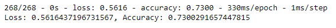
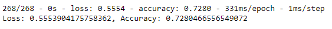
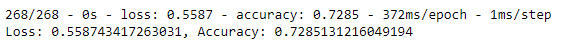
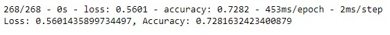

# Neural_Network_Charity_Analysis
## Overview of Analysis

### In this analysis we utilize machine learning and neural networks help the Alphabet Soup foundation make predictions on where to invest. We do this by looking at a datset of more than 34,000 orginizations that have received funds from Alphabet Soup in the past.

## Results

### Analyzing the data required me to use data preprocessing as well as compiling, training and evaulating the machine learning model. Below I have broken down and bulleted some of the findings.

  - **Preprocessing**
    - The ***Target*** variable in this dataset was the 'IS_SUCCESSFUL' column.
    - The ***Feature*** variables initially consisted of the 'STATUS', 'ASK_AMT', 'USE_CASE', 'APPLICATION_TYPE', 'AFFILIATION', 'CLASSIFICATION', 'ORGANIZATION', 'INCOME_AMT', 'SPECIAL_CONSIDERATIONS' columns. Though this changed during optimization.
    - The variables that were not Targets or Features were the 'EIN' and 'NAME' columns. But in my optimization attempts I also removed 'STATUS', 'SPECIAL_CONSIDERATIONS', 'USE_CASE'.

  - **Compiling, Training, and Evaluating the Model**
    - In the end I used KerasTuner and Hyperband to search for best model makeup. The final model I tried had 5 layers. The first layer had 19 neurons, followed by 15 neurons, 17 neurons, 5 neurons and 9 neurons. Each of the layers used the relu activation.
    - I was not able to achive 75% accuracy. The highest accuracy I got was with my third optimization which achieved 73% accuracy 
    - I made three attempts to optimize my model. I will break them down.
      - ***Pre-Optimization:*** The first model I tried had 72.8% accuracy and had two layers plus the output. The first layer had 10 nodes and used the relu activation. The second layer had 5 nodes also using relu. 
      - ***Optimization 1:*** My first optimization also had 72.8% accuracy and had three layers plus the output. In this attempt I modified the feature columns by removing the noisy variables STAUS, USE_CASE and SPECIAL_CONSIDERATIONS. I also changed Layer 1 Nodes to 136, Layer 2 Nodes to 68 and Activation to tanh, and added a third Layer with 34 Nodes and selu Activation. 
      - ***Optimization 2:*** My next optimization also had 72.8% accuracy and had five layers plus the output. In this attempt I kept the same feature columns as the previous attempt. I changed Layer 1 Nodes to 128, Layer 2 Nodes to 64 and Activation to elu, Layer 3 Nodes to 32, and added a fourth Layer with 16 Nodes and relu activation, and added a fifth Layer with 8 Nodes using relu. 
      - ***Optimization 3:*** My last optimization had 73% accuracy and had five layers plus the output. Here I used KerasTuner and Hyperband to search for best model makeup. In this attempt I kept the same feature columns as the previous attempt. I changed Layer 1 Nodes to 19, Layer 2 Nodes to 15 and Activation to relu, Layer 3 Nodes to 17, Layer 4 Nodes to 5, and Layer 5 Nodes to 9. I also changed the epoch count to 100 from the 50 used in previous attempts. 

## Summary

### Looking at the results of the analysis I believe bigger tweaks to the model would be necessary to achieve any signifigant improvement on the accuracy or loss metrics. After applying one hot encoding the dataset contains over 40 columns. Considering the column count, two other approaches I might take to this data are, first,  applying Random Forest to the dataset because Random Forest can both handle a large quantity of input variables and rank the input variables which might help in elimiating some features and making the data easier to work with. Another apporach might be allpying PCA. PCA's feature extraction would also make the data easier to work with by eliniating/condensing input variables.
